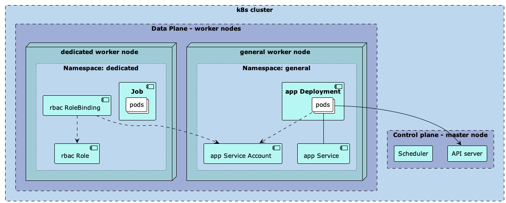
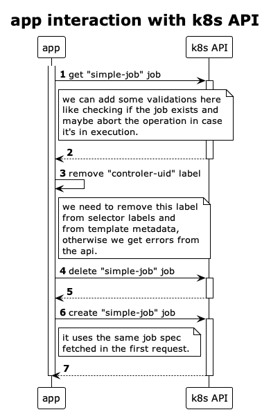

# PoC - Triggering a k8s job from a java application

This project shows a possible solution of how to trigger a k8s job from a java application. 
As secondary objectives:
- it aims to provide a way to configure the k8s resources to guarantee
that some pods are schedule only to particular nodes;
- restrict a node in such way that only certain pods can run on it, avoiding that undesired pods 
get scheduled to it;
- restrict the k8s api access to specific resources;
- evaluate k8s client libraries;



## Prerequisites

In order to run this project on your local machine you need to have installed the following tools: 
- Docker - for this experiment, I'm using [Rancher Desktop](https://docs.rancherdesktop.io/getting-started/installation/) on Mac OS;
- [docker compose](https://docs.docker.com/compose/install/);
- [kubectl](https://kubernetes.io/docs/tasks/tools/);

## Setting up the local container registry

```shell
$ sudo bash -c 'echo "127.0.0.1       registry.local" >> /etc/hosts'
```

### Setting insecure registry on Rancher Desktop on Mac OS

The following solution is based on this [Stackoverflow question](https://stackoverflow.com/questions/70971697/modify-docker-daemon-configuration-in-rancher-desktop-vm).

```shell
$ LIMA_HOME="$HOME/Library/Application Support/rancher-desktop/lima" "/Applications/Rancher Desktop.app/Contents/Resources/resources/darwin/lima/bin/limactl" shell 0
$ sudo vi /etc/conf.d/docker
DOCKER_OPTS="--insecure-registry=registry.local:5000"
$ sudo bash -c 'echo "<your-host-machine-ip>       registry.local" >> /etc/hosts' 
```

On Linux systems, you can edit the `/etc/docker/daemon.json` file and include:
```json
{
    “insecure-registries” : [“registry.local:5000”]
}
```

## Quick-Start

In the root directory of this repository you will find a `Makefile` which has some useful targets defined
to help with things like configure the stack, check k8s resources status, check application logs, and so on. 

Let's get the stack started. From the repository root directory, execute the following command on your terminal:

```shell
$ make bootstrap
```

This command will:
- bringing up and configure a private container registry and a k8s cluster composed by a master node 
and two worker nodes;
- deploy the sample job - a simple busybox container that counts to X and exits;
- build the container image for the sample java application
- push the container image to the private container registry to be accessible from the k8s cluster
- apply the creation of the following components:
  - general and dedicated namespaces;
  - rbac Role and RoleBinding;
  - app Service Account, Deployment, and Service;

It looks like this:

````shell
$ docker-compose ps
NAME                    COMMAND                  SERVICE             STATUS              PORTS
dedicated-worker-node   "/bin/k3s agent --no…"   agent-2             running             
general-worker-node     "/bin/k3s agent --no…"   agent-1             running             
master-node             "/bin/k3s server --n…"   server              running (healthy)   0.0.0.0:80->80/tcp, :::80->80/tcp, 0.0.0.0:443->443/tcp, :::443->443/tcp, 0.0.0.0:6443->6443/tcp, :::6443->6443/tcp
registry                "/entrypoint.sh /etc…"   registry.local      running (healthy)   0.0.0.0:5000->5000/tcp, :::5000->5000/tcp
````

And these are the k8s components we just created:

```shell
$ make get
------------------
general namespace:
------------------
NAME                                  READY   STATUS              RESTARTS   AGE   IP       NODE              NOMINATED NODE   READINESS GATES
pod/app-job-trigger-54885f54f-ngblb   0/1     ContainerCreating   0          5s    <none>   server-65465c63   <none>           <none>

NAME                      TYPE           CLUSTER-IP    EXTERNAL-IP   PORT(S)          AGE   SELECTOR
service/app-job-trigger   LoadBalancer   10.43.95.99   <pending>     8080:32354/TCP   5s    app=app-job-trigger

NAME                              READY   UP-TO-DATE   AVAILABLE   AGE   CONTAINERS   IMAGES                                      SELECTOR
deployment.apps/app-job-trigger   0/1     1            0           5s    app          registry.local:5000/app-job-trigger:local   app=app-job-trigger

NAME                                        DESIRED   CURRENT   READY   AGE   CONTAINERS   IMAGES                                      SELECTOR
replicaset.apps/app-job-trigger-54885f54f   1         1         0       5s    app          registry.local:5000/app-job-trigger:local   app=app-job-trigger,pod-template-hash=54885f54f
--------------------
dedicated namespace:
--------------------
NAME                   READY   STATUS    RESTARTS   AGE   IP          NODE                        NOMINATED NODE   READINESS GATES
pod/simple-job-bjw5d   1/1     Running   0          18s   10.42.0.2   dedicated-worker-f150a47e   <none>           <none>

NAME                   COMPLETIONS   DURATION   AGE   CONTAINERS   IMAGES    SELECTOR
job.batch/simple-job   0/1           19s        27s   busybox      busybox   controller-uid=5e846c5c-c213-4a4f-bc79-de595c200bc9
```

The `make get` command, shows all k8s components defined on general and dedicated namespaces.

### kubectl config

After you have the containers running, a `kubeconfig.yaml` file will be available in the repository's
root directory. You can use this file when issuing `kubectl` commands. You can either pass the
`--kubeconfig=./kubeconfig.yaml` parameter or export the `KUBECONFIG` environment variable.

> On the Makefile, the parameter approach is being used.

```shell
$ kubectl --kubeconfig=./kubeconfig.yaml get pods
# or
$ export KUBECONFIG=$(pwd)/kubeconfig.yaml
$ kubectl get pods
```

### Rerun the job

The following commands will amke a port forward and call an application endpoint, that in turn, 
will call the k8s apis to fetch the job, delete it, and then recreate it.

```shell
$ make app-forward
Forwarding from 127.0.0.1:8080 -> 8080
Forwarding from [::1]:8080 -> 8080

$ make trigger-job
HTTP/1.1 200 
Content-Length: 0
Date: Fri, 17 Feb 2023 22:00:13 GMT

```

The following diagram depicts this interaction:



You can check the job logs using this command:
```shell
$ make job-logs
[22:00:16] Job started
1
2
3
...
29
30
[22:00:46] Job Done!
```
